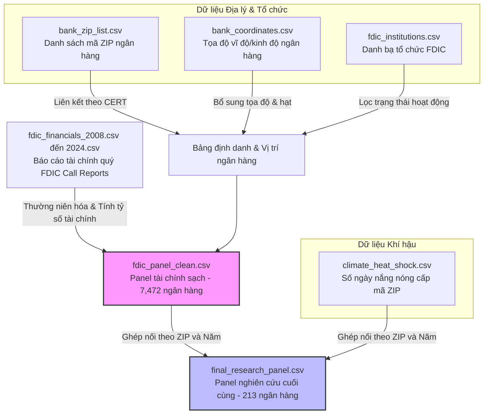

# CƠ SỞ DỮ LIỆU NGHIÊN CỨU: TÁC ĐỘNG CỦA CÚ SỐC NHIỆT ĐỘ LÊN SỰ ỔN ĐỊNH NGÂN HÀNG

Tài liệu này mô tả chi tiết cấu trúc bộ dữ liệu (dataset) được sử dụng trong nghiên cứu khoa học về tác động của rủi ro khí hậu vật lý (đại diện bằng số ngày sốc nhiệt - `HEAT_DAYS` và nhiệt độ tối đa trung bình - `TMAX_AVG`) lên sự ổn định của hoạt động ngân hàng thương mại tại Mỹ (thông qua tỷ lệ nợ xấu `NPL_ratio` và chỉ số an toàn `Z_score`).

Dữ liệu thô và dữ liệu đã xử lý được lưu trữ tại thư mục: [data/fdic/]

---

## 1. Sơ đồ luồng dữ liệu (Data Pipeline)

Sơ đồ dưới đây minh họa cách thức kết hợp các nguồn dữ liệu thô (thông tin định danh ngân hàng, tọa độ địa lý, dữ liệu khí hậu và báo cáo tài chính FDIC Call Reports) để tạo ra bảng dữ liệu tổng hợp phục vụ nghiên cứu:

---

## 2. Mô tả chi tiết các tệp dữ liệu (Data Files Specification)

### 2.1. Dữ liệu địa lý và tổ chức ngân hàng

#### [bank_zip_list.csv]
* **Mô tả:** Chứa thông tin ánh xạ mã định danh ngân hàng với mã vùng ZIP (Zip code) trụ sở chính.
* **Kích thước:** 326.21 KB | **Số dòng:** 6,949 | **Số cột:** 5
* **Chi tiết cấu trúc cột:**
  | Tên cột | Kiểu dữ liệu | Số lượng Null | Mô tả ý nghĩa |
  | :--- | :--- | :--- | :--- |
  | `CERT` | int64 | 0 | Mã số chứng nhận FDIC (Khóa chính) |
  | `NAME` | object | 0 | Tên ngân hàng |
  | `ZIP` | int64 | 0 | Mã ZIP Code của trụ sở chính |
  | `CITY` | object | 0 | Thành phố đặt trụ sở |
  | `STALP` | object | 0 | Mã viết tắt của Bang (ví dụ: MA, TX) |

#### [bank_coordinates.csv]
* **Mô tả:** Cung cấp tọa độ địa lý chi tiết (kinh độ, vĩ độ) và hạt hành chính (county) của từng ngân hàng.
* **Kích thước:** 495.94 KB | **Số dòng:** 6,936 | **Số cột:** 8
* **Chi tiết cấu trúc cột:**
  | Tên cột | Kiểu dữ liệu | Số lượng Null | Mô tả ý nghĩa |
  | :--- | :--- | :--- | :--- |
  | `CERT` | int64 | 0 | Mã số chứng nhận FDIC |
  | `NAME` | object | 0 | Tên ngân hàng |
  | `ZIP` | int64 | 0 | Mã ZIP |
  | `CITY` | object | 0 | Thành phố |
  | `STALP` | object | 0 | Mã viết tắt của Bang |
  | `latitude` | float64 | 0 | Vĩ độ địa lý của trụ sở chính |
  | `longitude` | float64 | 0 | Kinh độ địa lý của trụ sở chính |
  | `county` | object | 0 | Tên hạt (County) đặt trụ sở |

#### [fdic_institutions.csv]
* **Mô tả:** Danh bạ tổng hợp toàn bộ các tổ chức tài chính được FDIC bảo hiểm (bao gồm cả tổ chức đang hoạt động và đã đóng cửa).
* **Kích thước:** 2.32 MB | **Số dòng:** 23,371 | **Số cột:** 12
* **Chi tiết cấu trúc cột:**
  | Tên cột | Kiểu dữ liệu | Số lượng Null | Mô tả ý nghĩa |
  | :--- | :--- | :--- | :--- |
  | `ZIP` | int64 | 0 | Mã ZIP |
  | `CITY` | object | 0 | Thành phố |
  | `ACTIVE` | int64 | 0 | Trạng thái hoạt động (1: Đang hoạt động, 0: Đã giải thể/sát nhập) |
  | `CLASS` | object | 0 | Phân loại ngân hàng (ví dụ: SM, NM, N) |
  | `STNAME` | object | 0 | Tên đầy đủ của Bang |
  | `ENDEFYMD` | object | 0 | Ngày đóng cửa hoặc chấm dứt bảo hiểm |
  | `CERT` | int64 | 0 | Mã số chứng nhận FDIC |
  | `STALP` | object | 0 | Mã viết tắt của Bang |
  | `ESTYMD` | object | 0 | Ngày thành lập (Định dạng: MM/DD/YYYY) |
  | `NAME` | object | 0 | Tên tổ chức |
  | `ID` | int64 | 0 | ID định danh nội bộ |
  | `ASSET` | float64 | 2,555 | Tổng tài sản tại kỳ báo cáo gần nhất |

---

### 2.2. Dữ liệu khí hậu và thời tiết cực đoan

#### [climate_heat_shock.csv]
* **Mô tả:** Chứa các chỉ số về cú sốc nhiệt độ cấp độ mã ZIP hàng năm.
* **Kích thước:** 80.93 KB | **Số dòng:** 2,550 | **Số cột:** 4
* **Chi tiết cấu trúc cột:**
  | Tên cột | Kiểu dữ liệu | Số lượng Null | Mô tả ý nghĩa |
  | :--- | :--- | :--- | :--- |
  | `year` | int64 | 0 | Năm quan sát (2008 - 2024) |
  | `ZIP` | int64 | 0 | Mã ZIP nơi đo đạc |
  | `HEAT_DAYS` | int64 | 0 | Số ngày có nhiệt độ tối đa vượt ngưỡng P90 lịch sử của vùng |
  | `TMAX_AVG` | float64 | 0 | Nhiệt độ tối đa trung bình hàng ngày trong năm (°C) |

---

### 2.3. Dữ liệu tài chính thô hàng năm 
* **Mô tả:** 17 tệp dữ liệu tài chính cấp quý của các ngân hàng thương mại được FDIC bảo hiểm.
* **Kích thước trung bình:** ~2.0 MB - 3.6 MB mỗi tệp | **Số dòng mỗi tệp:** ~34,000 | **Số cột:** 14
* **Chi tiết các biến tài chính thô chính:**
  | Tên cột | Kiểu dữ liệu | Ý nghĩa tài chính |
  | :--- | :--- | :--- |
  | `CERT` | int64 | Mã chứng nhận ngân hàng |
  | `REPDTE` | int64 | Ngày báo cáo tài chính (Định dạng: YYYYMMDD, ví dụ: 20080331) |
  | `ASSET` | int64 | Tổng tài sản (Total Assets) |
  | `EQTOT` | float64 | Tổng vốn chủ sở hữu (Total Equity Capital) |
  | `LNLSNET` | int64 | Cho vay ròng (Net Loans and Leases) |
  | `NIM` | float64 | Biên tỷ suất lợi nhuận thuần (Net Interest Margin) |
  | `ROA` | float64 | Tỷ suất lợi nhuận trên tài sản (Return on Assets, quy về tỷ lệ %) |
  | `RBCT1J` | float64 | Vốn cấp 1 (Tier 1 Risk-based Capital) |
  | `NAASSET` | int64 | Tài sản không sinh lời / Nợ không thu được lãi (Nonaccrual Assets) |
  | `P9ASSET` | int64 | Khoản vay quá hạn 90 ngày trở lên nhưng vẫn tính lãi (Loans Past Due 90+ Days) |
  | `P3ASSET` | int64 | Khoản vay quá hạn 30-89 ngày và vẫn tính lãi |
  | `NONII` | float64 | Thu nhập phi lãi (Noninterest Income) |
  | `NONIX` | float64 | Chi phí phi lãi (Noninterest Expense) |
  | `ID` | object | Khóa định danh bản ghi báo cáo quý (`{CERT}_{REPDTE}`) |

---

### 2.4. Các bảng Panel tổng hợp phục vụ mô hình

#### [fdic_panel_clean.csv] (Toàn bộ ngân hàng)
* **Mô tả:** Bảng panel cấp ngân hàng - năm chứa các dữ liệu tài chính đã được làm sạch, quy về đơn vị năm và tính toán sẵn các tỷ số tài chính then chốt cho toàn bộ 7,472 ngân hàng tại Mỹ giai đoạn 2009-2024.
* **Kích thước:** 39.27 MB | **Số dòng:** 95,154 | **Số cột:** 37
* **Phương pháp tính các biến tài chính quan trọng:** xem chi tiết tại [Mục 3](#3-công-thức-và-phương-pháp-tính-các-biến-chính).

#### [final_research_panel.csv] (Panel nghiên cứu chính thức)
* **Mô tả:** Bộ dữ liệu nghiên cứu chính thức được tạo ra bằng cách kết hợp thông tin địa lý của ngân hàng, dữ liệu tài chính đã làm sạch và dữ liệu nhiệt độ cực đoan thông qua khớp mã `ZIP` và mã `year`.
* **Kích thước:** 1.23 MB | **Số dòng:** 2,818 | **Số cột:** 39
* **Đặc điểm mẫu nghiên cứu:**
  * Giai đoạn thời gian: **2009 - 2024** (16 năm).
  * Quy mô mẫu: **213 ngân hàng** hoạt động liên tục hoặc có báo cáo đầy đủ trong giai đoạn này.
  * Phạm vi địa lý: Phân bổ trên **150 mã ZIP** thuộc **12 bang** của Mỹ bao gồm: **TX, VA, WV, WI, CT, MA, KY, AL, ID, WA, CO, OK**.
  * Chứa bổ sung các biến kiểm soát trễ (lag) 1 năm (`lag1`) và 2 năm (`lag2`) để phân tích tác động trễ của cú sốc thời tiết.

---

## 3. Công thức và phương pháp tính các biến chính

Để đảm bảo tính nhất quán của nghiên cứu kinh tế lượng, các biến tài chính trong bảng panel được định nghĩa và tính toán như sau:

### 3.1. Chỉ số rủi ro phá sản (Z-score)
Đại diện cho sự ổn định tài chính tổng thể của ngân hàng (khoảng cách đến khả năng vỡ nợ):
$$Z\_score_{i,t} = \frac{ROA\_annual_{i,t} + ETA\_ratio_{i,t} \times 100}{ROA\_sd3_{i,t}}$$

*Trong đó:*
* `ROA_annual`: Tỷ suất sinh lời trung bình năm của tài sản (%).
* `ETA_ratio * 100`: Tỷ lệ vốn chủ sở hữu trên tổng tài sản (`EQTOT / ASSET_avg`) quy đổi về đơn vị phần trăm — đại diện cho phần đệm vốn thực tế ngân hàng dùng để hấp thụ lỗ. **Lưu ý:** `CAR` (Capital Adequacy Ratio) là khái niệm khác (Tier 1 / Risk-Weighted Assets theo chuẩn Basel), không dùng trong công thức Z-score mà được giữ riêng làm biến kiểm soát.
* `ROA_sd3`: Độ lệch chuẩn của chỉ số ROA tính trên cửa sổ trượt 3 năm gần nhất nhằm đại diện cho mức độ biến động lợi nhuận ngân hàng.
* `ln_Zscore`: Logarit tự nhiên của Z-score để phân phối biến tiệm cận phân phối chuẩn trong mô hình OLS.

### 3.2. Tỷ lệ nợ xấu (NPL Ratio)
Chỉ số đại diện cho chất lượng tài sản và rủi ro tín dụng của ngân hàng thương mại:
$$NPL\_ratio_{i,t} = \frac{NPL\_p9\_annual_{i,t} + NPL\_na\_annual_{i,t}}{ASSET\_avg_{i,t}} \times 100$$

*Trong đó:*
* `NPL_p9_annual`: Khoản vay quá hạn 90+ ngày (nhưng vẫn tính lãi).
* `NPL_na_annual`: Tài sản nợ không sinh lời (nonaccrual).
* `ASSET_avg`: Tổng tài sản bình quân năm của ngân hàng.

### 3.3. Quy mô ngân hàng (SIZE)
$$SIZE_{i,t} = \ln(ASSET\_avg_{i,t} \times 1000)$$
*Lưu ý:* Tổng tài sản được nhân với 1,000 để quy về đơn vị Đô la Mỹ thực tế trước khi lấy Logarithm. Biến này đã được xử lý **Winsorize ở mức 1% - 99%** để loại bỏ các ngân hàng quá nhỏ hoặc các tập đoàn tài chính siêu lớn làm sai lệch mô hình. Giá trị `SIZE` tối đa bị chặn ở ngưỡng **24.064934** (tương đương quy mô tài sản tối đa khoảng 28.26 tỷ USD).

### 3.4. Các biến kiểm soát tài chính khác
* **NIM (Net Interest Margin):** Biên tỷ suất lợi nhuận thuần từ lãi ròng.
* **CAR (Capital Adequacy Ratio):** Tỷ lệ an toàn vốn (%) của ngân hàng.
* **LTD / LIQ (Liquidity indicators):** Các chỉ tiêu liên quan đến thanh khoản ngân hàng (bị khuyết giá trị ở một số năm do FDIC thay đổi biểu mẫu Call Report).
* **CLASS (Phân loại định chế):** Ngân hàng thuộc phân khúc State Member (SM), State Nonmember (NM) hoặc National Bank (N).

---
