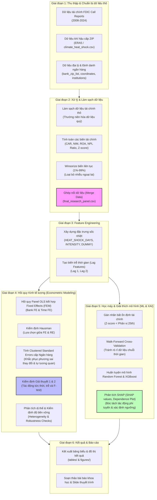

# QUY TRÌNH THỰC HIỆN NGHIÊN CỨU (RESEARCH PROCESS FLOW)

Tài liệu này mô tả chi tiết quy trình thực hiện nghiên cứu khoa học về **"Tác động của yếu tố thời tiết lên hoạt động ổn định của ngân hàng"**. Quy trình này được xây dựng dựa trên thiết kế cấu trúc dự án tại [README.md], cơ sở dữ liệu tại [DATABASE.md] và các nguyên tắc nghiên cứu khoa học tại [RULE.md].

---

## 1. Sơ đồ quy trình tổng quan (Workflow Diagram)

---

## 2. Các bước triển khai chi tiết (Step-by-Step Guide)

### Bước 1: Thu thập và chuẩn bị dữ liệu thô (Data Collection & Preparation)
* **Mục tiêu:** Thu thập đầy đủ các nguồn dữ liệu cần thiết phục vụ cho việc tính toán các chỉ số kinh tế lượng và rủi ro thời tiết.
* **Chi tiết thực hiện:**
  1. Thu thập danh sách ngân hàng thương mại được bảo hiểm bởi FDIC cùng mã định danh `CERT` và mã vùng `ZIP` đặt trụ sở tại [bank_zip_list.csv].
  2. Thu thập tọa độ địa lý (kinh độ, vĩ độ) và hạt hành chính tại [bank_coordinates.csv] phục vụ phân tích địa lý/dị thể.
  3. Tải dữ liệu khí tượng thủy văn theo lưới tọa độ từ ERA5, trích xuất số ngày sốc nhiệt hàng năm cho từng mã ZIP tại [climate_heat_shock.csv] chứa thông tin `HEAT_DAYS` (số ngày nhiệt độ vượt ngưỡng P90 lịch sử) và `TMAX_AVG` (nhiệt độ tối đa trung bình).
  4. Thu thập báo cáo tài chính quý FDIC Call Reports giai đoạn 2008-2024 để lấy các biến tài chính thô như tổng tài sản (`ASSET`), vốn chủ sở hữu (`EQTOT`), cho vay ròng (`LNLSNET`), thu nhập lãi ròng, tài sản không sinh lời (`NAASSET`), nợ quá hạn (`P9ASSET`, `P3ASSET`).
* **Mã nguồn liên quan:**
  * [load_data.py] - Tải dữ liệu thô từ các nguồn.
  * Thư mục lưu trữ dữ liệu thô: [data/raw/]

### Bước 2: Xử lý và làm sạch dữ liệu (Data Preprocessing)
* **Mục tiêu:** Làm sạch dữ liệu, xử lý các giá trị khuyết thiếu (NaN), thường niên hóa số liệu quý và tạo bộ dữ liệu Panel nghiên cứu hoàn chỉnh.
* **Chi tiết thực hiện:**
  1. Lọc và chỉ giữ lại các tổ chức tài chính đang hoạt động dựa trên [fdic_institutions.csv].
  2. Quy đổi các báo cáo tài chính cấp quý về dạng thường niên (Annualized) để có dữ liệu cấp ngân hàng - năm đồng nhất.
  3. Áp dụng kỹ thuật **Winsorize** ở mức 1%-99% đối với các biến liên tục để giảm thiểu tác động lệch của các giá trị ngoại lai (outliers) cực đoan (đặc biệt là biến quy mô tài sản `SIZE`).
  4. Thực hiện khớp nối (Merge) dữ liệu tài chính với dữ liệu khí hậu theo thuộc tính chung là `ZIP` và năm `year` để tạo ra tệp dữ liệu panel cuối cùng chứa mẫu gồm 213 ngân hàng hoạt động liên tục trong 16 năm (2009-2024).
* **Mã nguồn & Notebooks liên quan:**
  * [clean_bank_data.py] - Làm sạch dữ liệu FDIC.
  * [clean_climate_data.py] - Xử lý dữ liệu thời tiết.
  * [merge_data.py] - Tích hợp các nguồn dữ liệu thô thành tệp panel.
  * [winsorize.py] - Khử nhiễu giá trị ngoại lai.
  * Notebook: [02_data_cleaning]
  * File kết quả trung gian: [fdic_panel_clean.csv] và [final_research_panel.csv].

### Bước 3: Xây dựng đặc trưng (Feature Engineering)
* **Mục tiêu:** Tạo lập các biến kinh tế lượng và chỉ số rủi ro khí hậu theo đúng mô hình lý thuyết.
* **Chi tiết thực hiện:**
  1. **Biến phụ thuộc Y:**
     * `NPL_ratio`: Tính tỷ lệ nợ xấu trên tổng tài sản trung bình (%).
     * `Z_score`: Tính khoảng cách đến vỡ nợ bằng công thức $Z = (ROA + ETA) / Std(ROA)$, trong đó `ETA` là tỷ lệ vốn chủ sở hữu trên tổng tài sản (`EQTOT / ASSET_avg`). Độ lệch chuẩn của ROA được tính trên cửa sổ trượt 3 năm gần nhất. Lấy Logarit tự nhiên (`ln_Zscore`) để chuẩn hóa phân phối.
  2. **Biến độc lập X (Khí hậu):**
     * `HEAT_SHOCK_DAYS`: Tổng số ngày trong năm t có nhiệt độ vượt ngưỡng P90 lịch sử của khu vực.
     * `HEAT_SHOCK_INTENSITY`: Cường độ của cú sốc nhiệt.
     * `HEAT_SHOCK_DUMMY`: Biến giả thể hiện năm t khu vực của ngân hàng có xảy ra cú sốc nhiệt hay không.
  3. **Biến trễ (Lag Variables):**
     * Tạo biến trễ 1 và 2 năm (`HEAT_SHOCK_DAYS_(t-1)`, `HEAT_SHOCK_DAYS_(t-2)`, `HEAT_SHOCK_DUMMY_(t-1)`, `HEAT_SHOCK_DUMMY_(t-2)`) để kiểm định giả thuyết tác động có độ trễ của rủi ro vật lý lên hệ thống ngân hàng (doanh nghiệp vay vốn có độ trễ chịu đựng trước khi thực sự vỡ nợ/nợ xấu).
  4. **Biến kiểm soát (Control Variables):**
     * Biến cấp ngân hàng: Quy mô tài sản (`SIZE` = $ln(Asset \times 1000)$), tỷ lệ an toàn vốn (`CAR`), biên tỷ suất lợi nhuận ròng (`NIM`), và tỷ suất sinh lời trên tài sản (`ROA`).
     * Biến vĩ mô: Tăng trưởng GDP vùng (`GDP_GROWTH`), tỷ lệ thất nghiệp (`UNEMPLOYMENT`), và lạm phát (`INFLATION`).
* **Mã nguồn & Notebooks liên quan:**
  * [target_variables.py] - Tính toán `NPL_ratio` và `Z_score`.
  * [heat_shock_days.py] - Tính số ngày sốc nhiệt.
  * [lag_features.py] - Tạo các biến trễ thời gian.
  * Notebook: [03_feature_engineering]

### Bước 4: Phân tích dữ liệu khám phá (Exploratory Data Analysis - EDA)
* **Mục tiêu:** Hiểu rõ cấu trúc phân phối, kiểm tra tính toàn vẹn của dữ liệu và loại bỏ các vấn đề liên quan đến đa cộng tuyến.
* **Chi tiết thực hiện:**
  1. Thống kê mô tả (Descriptive Statistics): Tính Mean, SD, Min, Max, Median cho tất cả các biến tài chính và khí hậu.
  2. Phân tích tương quan (Correlation Analysis): Vẽ ma trận tương quan giữa các biến độc lập và biến kiểm soát để phát hiện sớm hiện tượng đa cộng tuyến (VIF test).
  3. Vẽ biểu đồ xu hướng khí hậu: Biểu diễn sự phân bố địa lý của mẫu ngân hàng và sự biến động của số ngày sốc nhiệt qua các năm 2008-2024.
* **Mã nguồn & Notebooks liên quan:**
  * [eda_plots.py] - Các hàm vẽ biểu đồ phân tích.
  * Notebook: [04_exploratory_data_analysis]

### Bước 5: Mô hình hóa Kinh tế lượng (Econometric Modeling)
* **Mục tiêu:** Đánh giá mối quan hệ nhân quả tuyến tính và kiểm định các kênh tác động ngắn hạn của sốc nhiệt lên độ ổn định ngân hàng.
* **Chi tiết thực hiện:**
  1. Thiết lập mô hình hồi quy dữ liệu bảng (Panel Data Regression):
     $$Y_{i,t} = \alpha_i + \gamma_t + \beta_1 X_{i,t} + \beta_2 Controls_{i,t} + \epsilon_{i,t}$$
     * $\alpha_i$: Bank Fixed Effects (Kiểm soát các đặc trưng không đổi theo thời gian của từng ngân hàng).
     * $\gamma_t$: Time Fixed Effects (Kiểm soát các cú sốc vĩ mô chung qua từng năm).
  2. Thực hiện các kiểm định lựa chọn mô hình:
     * Chạy ước lượng Pooled OLS, Fixed Effects Model (FEM), và Random Effects Model (REM).
     * Thực hiện **Hausman Test** để xác định mô hình FEM hay REM là tối ưu nhất (giả thuyết $H_0$: REM tối ưu).
  3. Áp dụng **Clustered Standard Errors by Bank** (Sai số chuẩn phân cụm theo ngân hàng) để xử lý hiện tượng tự tương quan chuỗi và phương sai sai số thay đổi.
  4. Thực hiện hồi quy kiểm định 2 giả thuyết chính:
     * **Giả thuyết 1 (Mô hình Tần suất & Cường độ):** Hồi quy biến phụ thuộc Y theo `HEAT_SHOCK_DAYS`, `HEAT_SHOCK_INTENSITY` và biến trễ `HEAT_SHOCK_DAYS_(t-1)`. Sử dụng F-test để kiểm định xem các hệ số hồi quy của biến khí hậu có đồng thời bằng 0 hay không.
     * **Giả thuyết 2 (Mô hình Biến giả & Cường độ):** Hồi quy biến phụ thuộc Y theo biến giả xuất hiện sốc nhiệt `HEAT_SHOCK_DUMMY`, cường độ tác động và biến trễ 1 năm `HEAT_SHOCK_DUMMY_(t-1)`.
  5. Phân tích dị thể (Heterogeneity Analysis): Chia mẫu nghiên cứu theo quy mô tài sản (Ngân hàng Lớn vs Ngân hàng Nhỏ) và vùng địa lý để đánh giá mức độ nhạy cảm khác biệt.
  6. Kiểm định độ bền vững (Robustness Checks): Thay đổi cách đo lường biến phụ thuộc hoặc biến độc lập để xác minh tính ổn định của các hệ số ước lượng.
* **Mã nguồn & Notebooks liên quan:**
  * [fixed_effects.py] - Ước lượng mô hình FE.
  * [clustered_se.py] - Điều chỉnh sai số chuẩn phân cụm.
  * [hausman_test.py] - Thực hiện Hausman Test.
  * [heterogeneity_analysis.py] - Hồi quy theo phân nhóm mẫu.
  * Notebook: [05_econometric_model] và [08_robustness_checks]

### Bước 6: Học máy & Giải thích mô hình phi tuyến (Machine Learning & XAI)
* **Mục tiêu:** Dự báo rủi ro bất ổn tài chính ngân hàng phi tuyến tính và bóc tách ngưỡng tác động của sốc nhiệt bằng SHAP.
* **Chi tiết thực hiện:**
  1. Định nghĩa trạng thái mất ổn định tài chính: Gán nhãn $1$ (rủi ro cao) khi chỉ số `Z-score` của ngân hàng nằm dưới ngưỡng phân vị thứ 25 ($25^{th}$ percentile) của toàn bộ mẫu, ngược lại gán nhãn $0$.
  2. Chia dữ liệu theo phương pháp **Walk-Forward Cross-Validation** để bảo vệ tính chất chuỗi thời gian của bảng dữ liệu, tránh hiện tượng rò rỉ thông tin tương lai (data leakage).
  3. Huấn luyện các thuật toán học máy: **Random Forest** và **XGBoost** với các đặc trưng đầu vào bao gồm các biến khí hậu (tần suất, cường độ, trễ) và các biến kiểm soát tài chính.
  4. Đánh giá chất lượng mô hình thông qua AUC-ROC, F1-Score, và ma trận nhầm lẫn (Confusion Matrix).
  5. Áp dụng phương pháp **SHAP (SHapley Additive exPlanations)** để:
     * Vẽ biểu đồ Feature Importance để xếp hạng mức độ đóng góp của rủi ro thời tiết so với các chỉ số tài chính truyền thống.
     * Vẽ **SHAP Dependence Plot** cho biến độc lập `HEAT_SHOCK_DAYS` nhằm bóc tách ngưỡng tác động phi tuyến tính (ví dụ: Số ngày nắng nóng vượt quá bao nhiêu ngày thì tác động tiêu cực bắt đầu gia tăng mạnh mẽ).
* **Mã nguồn & Notebooks liên quan:**
  * [walk_forward_cv.py] - Bộ chia tập train/test theo thời gian.
  * [xgboost_model.py] - Xây dựng mô hình XGBoost.
  * [shap_values.py] - Tính toán giá trị đóng góp SHAP.
  * [dependence_plot.py] - Biểu đồ phụ thuộc phi tuyến.
  * Notebook: [06_machine_learning] và [07_shap_analysis]

### Bước 7: Kết xuất kết quả và viết báo cáo (Reporting)
* **Mục tiêu:** Tổng hợp các kết quả thực nghiệm, hoàn thiện các tài liệu phục vụ hội đồng khoa học.
* **Chi tiết thực hiện:**
  1. Xuất bảng thống kê mô tả, ma trận tương quan và bảng kết quả hồi quy OLS/FE/RE ra thư mục [outputs/tables/].
  2. Lưu trữ các biểu đồ phân tích EDA, biểu đồ hồi quy và biểu đồ SHAP tại [outputs/figures/].
  3. Lưu các mô hình XGBoost/Random Forest đã huấn luyện và tệp giá trị SHAP vào [models/].
  4. Tiến hành viết các phần của bài báo khoa học (Đề cương, Tổng quan văn hiến, Phương pháp nghiên cứu, Kết quả thực nghiệm và Thảo luận) và chuẩn bị slide thuyết trình tại thư mục [paper/] và [presentations/].

---

## 3. Bản đồ cấu trúc thư mục thực thi (Execution Folder Mapping)

Dưới đây là liên kết giữa các bước trong quy trình thực hiện với các thành phần tương ứng trong cấu trúc thư mục dự án:

| Quy trình thực hiện | Module Code nguồn (`src/`) | Thư mục Jupyter Notebook | Kết quả đầu ra (`outputs/` & `models/`) |
| :--- | :--- | :--- | :--- |
| **Bước 1: Thu thập & tải dữ liệu** | [load_data.py] - Tải dữ liệu thô từ các nguồn. | [01_data_collection] | [data/raw/] |
| **Bước 2: Xử lý & Làm sạch dữ liệu** | [clean_bank_data.py] - Làm sạch dữ liệu FDIC. [clean_climate_data.py] - Xử lý dữ liệu thời tiết. [merge_data.py] - Tích hợp các nguồn dữ liệu thô thành tệp panel. [winsorize.py] - Khử nhiễu giá trị ngoại lai. | [02_data_cleaning] | [data/interim/] |
| **Bước 3: Xây dựng đặc trưng** | [target_variables.py] - Tính toán `NPL_ratio` và `Z_score`. [heat_shock_days.py] - Tính số ngày sốc nhiệt. [lag_features.py] - Tạo các biến trễ thời gian. | [03_feature_engineering] | [data/processed/] |
| **Bước 4: Phân tích EDA** | [eda_plots.py] - Các hàm vẽ biểu đồ phân tích. | [04_exploratory_data_analysis] | [outputs/tables/descriptive_statistics/] [outputs/figures/eda/] |
| **Bước 5: Mô hình Kinh tế lượng** | [fixed_effects.py] - Ước lượng mô hình FE. [clustered_se.py] - Điều chỉnh sai số chuẩn phân cụm. [hausman_test.py] - Thực hiện Hausman Test. [heterogeneity_analysis.py] - Hồi quy theo phân nhóm mẫu. | [05_econometric_model] [08_robustness_checks] | [models/econometrics/] [outputs/tables/regression_results/] |
| **Bước 6: Học máy & SHAP** | [walk_forward_cv.py] - Bộ chia tập train/test theo thời gian. [xgboost_model.py] - Xây dựng mô hình XGBoost. [shap_values.py] - Tính toán giá trị đóng góp SHAP. [dependence_plot.py] - Biểu đồ phụ thuộc phi tuyến. | [06_machine_learning] [07_shap_analysis] | [models/xgboost/] [outputs/figures/shap/] |
| **Bước 7: Báo cáo & Bài báo** | Không có module code | Không có notebook | [paper/final_paper/] [presentations/] |
